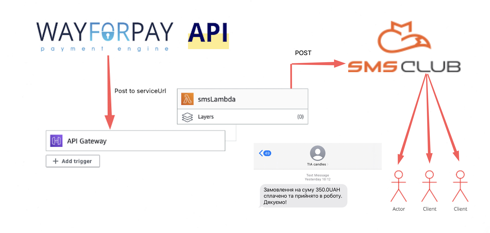

# Wayforpay & SmsClub AWS Lambda Integration

## Overview
This project is a Java-based AWS Lambda function that handles payment requests from Wayforpay payment provider. When a payment request is received, the function generates a response and sends an SMS notification to the client.

It includes an implementation of the RequestHandler interface, which requires the handleRequest() method to be implemented. The method takes a ServiceRequest object as input, sends an SMS using an instance of SmsService, and returns a ServiceResponse object.

The **calculateServiceResponse()** method creates a signature for the order request data using a HMAC-MD5 algorithm with a shared ***MERCHANT_SECRET*** key.

The code imports necessary packages and defines class-level variables for the Gson library, an SMS service, and a shared key. It also includes a utility method stringToHMACMD5() that creates an HMAC-MD5 signature from a given string.
After calculation, this lambda 'endpoint' returns status code 200 and String object, in order to verify sent request.

The string subject to HMAC_MD5 is generated by concatenating the parameters orderReference, status, time separated by ";" (semicolon) in UTF-8 encoding

`{
"orderReference":"DH783023",
"status":"accept",
"time":1415379863,
"signature":""
}`

## Installation

1. Clone the repository
2. Register in Wayforpay to obtain Merchant Secret Key
3. Register in SmsClub.mobi in order to use their API
4. Create Java 8 lambda function in pair with API Gateway
5. Configure system variables (MERCHANT_SECRET, SMS_CLUB_TOKEN, SMS_SENDER_NAME) through Environment Variables tab in Settings of lambda function
6. >mvn clean package
7. Deploy your lambda to aws by uploading or through S3bucket
8. Test you lambda with testEvent.json from event package

## Feel free to ask me any question or request for help!
